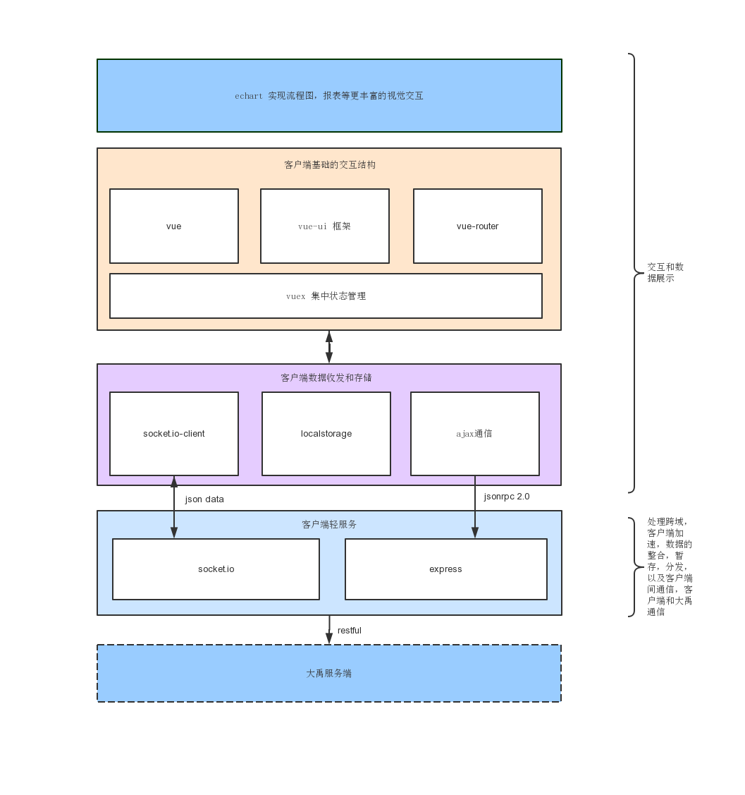

#大禹客户端端架构示意图

> 当前客户端泛指可以通过浏览器访问的方式（移动端，pc端...）,当前的架构都是适用的

## 客户端轻服务
> 客户端自行开发应用服务的方式，更大程度的分离了和服务端之间的关联。使用nodejs来开发这部分服务，可以方便前端快速构建自己需要的功能。

### socket.io
socket.io 是nodejs server 上使用WebSocket的一个方式，它能够和客户端之间进行双向的通信，可以替代客户端轮询的方式，来实现由服务端主动推送监控数据，即优化监控效果，也降低了客户端资源的开销。而且通过socket server 的中转，还能够实现客户端之间的通信，为成员互相协作办公带来了更多的可能

### express
express 是nodejs构建web服务的框架。目前主要使用它进行，gzip压缩，客户端页面缓存控制，转发消息至大禹，后台数据的整合，暂存

## 客户端断数据收发和存储

### socket.io-client
既socket.io提供的客户端方案，主要用于接收键控的数据，目前会向其他客户端发送功能的使用情况

### localstorage
用于在客户端本地存储一些认真信息，个性配置，操作状态等，这部分直接使用html5接口，没有使用三方技术

### ajax通信
用于收发操作的请求，目前使用的是轻量级的自研方案，只执行json格式的请求，可以自定义通信的实例，有较强的并发控制能力。并且提供监控收发状态的接口。通信核心部分可以无缝替换为jquery的$.ajax()

## 客户端基础交互结构
> 这部分完全使用的是基于vue的单页面应用方案，因为是单页面应用，所以它交互效率比多页面来的更高

### vuex
vue体系下的状态管理器，主要用于组件间的自由通信。socket.io-client获取的监控数据，以及localstorage的本地数据，会在这层控制变化，并提供方法，按需注入需要数据的任何一个模块。也可以通过这里，控制客户端全局状态

### vue 和vue ui框架
vue可以快速的构建应用的交互层，社区资源丰富，学习简单，而且也能够胜任大部分的应用开发。结合vue ui框架，能够快速，标准的构建项目。这里的vue ui框架是掌数自研的oui，已在公司内部多个应用上使用，且持续的升级优化中。这部分可以替换为主流的element ui，iview等同类型框架

## 更丰富的视觉

### echarts4.0
echart是百度推出的世界级的图表工具，使用较为简单，开发者活跃，社区案例齐全，计划使用它生成各类报表，以及封装工作流程监控图。

## 使用到的技术一览

技术 | 用途 | 协议
---|---|---
ejs | 用于生产html页面的模板工具 | AL2.0
scss | css预编译工具 | MIT
vue | 视图层框架  | MIT
vue-router | 实现SPA |MIT
vuex| SPA内数据状态管理 | MIT
echart | 图表，图形生产| AL2.0
oui  | vue ui框架 | 自研
webpack | 模块构建 | MIT
nodejs  | 用于部署nodejs服务 |~
socket.io | 实时通信  | MIT
express | nodejs服务框架 | MIT
